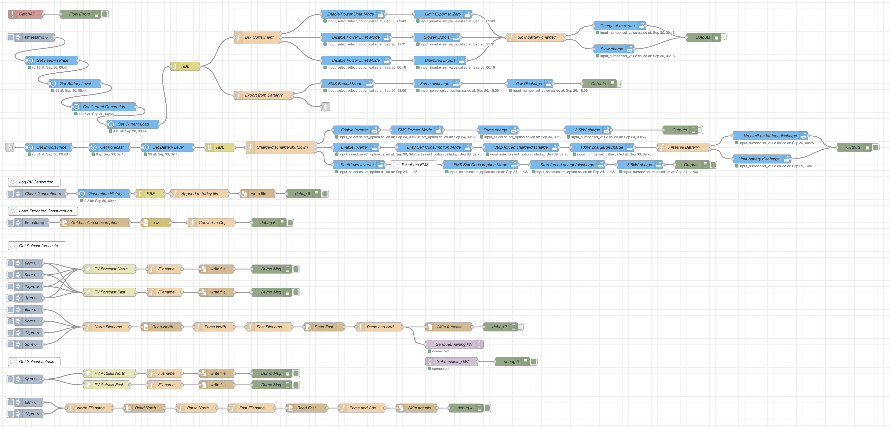

# Node-RED flow for managing a Solar+Battery system with Home Assistant

This flow uses the Sungrow Modbus solution provided by mkaiser https://github.com/mkaiser/Sungrow-SHx-Inverter-Modbus-Home-Assistant. I have a SH10RT and SBR128 battery combo, but other combos should work, you will just need to map equivalent controls and sensors to it as are provided by the Sungrow modbus integration.

* I use the Amber APIs to get the current and forecast solar price and feed-in tarriffs.
* A Solcast hobbyist account is used to get solar production forecasts.
* I use the VS Code add-on to review (and create) the needed files in HA.

If you try this flow, please let me know how it goes for you. In particular I am interested in any gaps or flaws in the simple logic approach I am using.

## Philosophy

Having experienced SmartShift, I felt that it was too slow to react to price changes (which are quite dynamic in the wholesale market), and that its decisions tended to be a bit opaque and sometimes not logical. I looked at EMHASS, but that seemed overly complicated and the idea of using machine learning on such volatile and unpredictable data, as well as the small data sets involved, seemed a poor fit.

I felt a Node-RED flow using up-to-date live data and able to directly control the system over the local LAN should be able to deliver as good a result or better. A lot of the important decisions are quite simple and mapping them out using flow-based programming makes that logic clear.

Even if you have a different system, I hope that the mapped-out logic provided in this flow can help you manage your own system, or build your own version of this that works for you.

